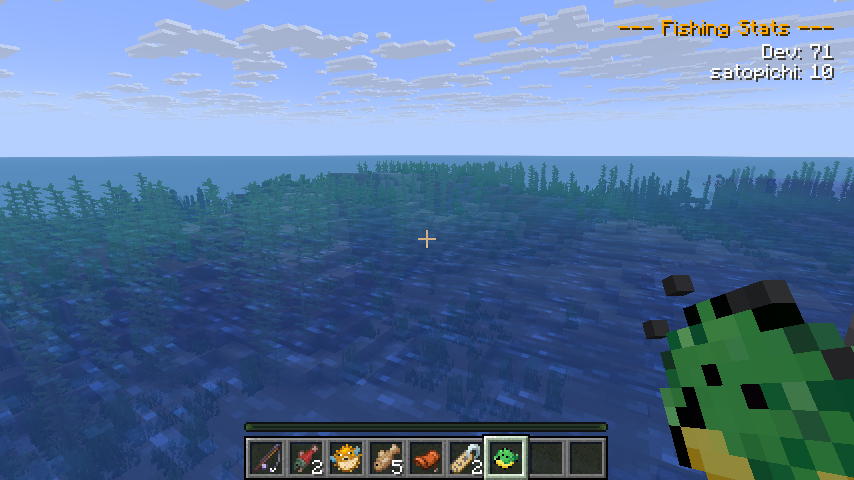
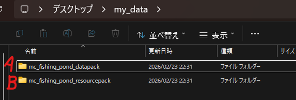
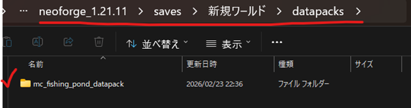
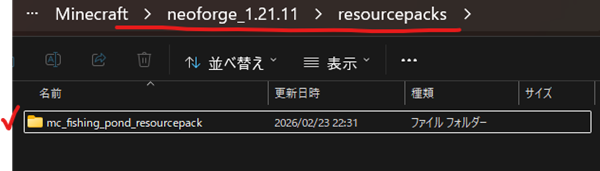
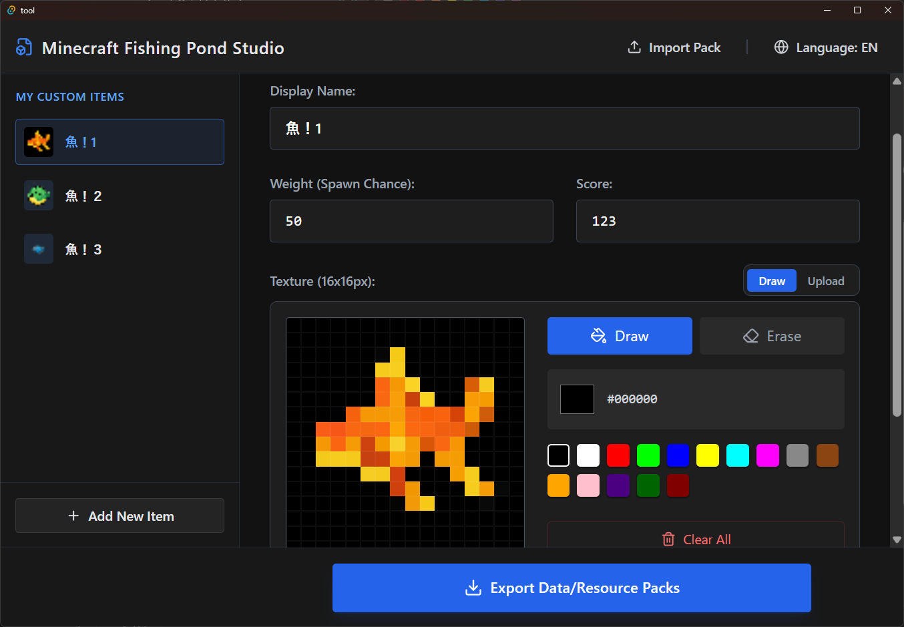

# 釣り堀Mod & Studio Tool

## modの説明

釣りアイテムの追加とスコア計算ができるmodです。追加アイテムを生成するツール「**MC Fishing Pond Studio**」もあります。
スコアはワールドに参加しているプレイヤー全員に共有されます。

### 🎣 Modの機能 (Features)

* **釣りアイテムの追加**: 自由に釣りアイテムを追加できます
* **スコアシステム**: 釣った魚に応じてスコアが加算され、サーバー内にいるプレイヤー全員にリアルタイムでスコア変動が同期されます。
* **管理者専用コマンド**: サーバー運営者（OP権限レベル必要）向けにスコアを管理するコマンドがあります
  * `/fishingpond score add <player> <amount>` - 指定プレイヤーのスコアを加算
  * `/fishingpond score reset <player>` - 指定プレイヤーのスコアを「0」にリセット
  * `/fishingpond give <player> <item_id>` - 任意の釣果アイテムを直接付与

### 💻 Fishing Pond Studio

釣りアイテムの追加に必要な「データパック」「リソースパック」を作成するためのツールです。  
（[Releases](https://github.com/datsuns/fishingpond/releases) から `.exe` をダウンロード可能です）

名前、釣れる確率、スコアを設定します。  
画像は「既にある画像の取り込み」「手動で描画」のどちらも可能です。  

### 📥 インストール方法 (How to Install)

1. **Mod本体**: ModrinthまたはReleasesから `fabric` / `neoforge` の `.jar` ファイルをダウンロードし、クライアントおよびサーバーの `mods` フォルダに配置します。
1. **釣りデータ作成**: `Fishing Pond Studio`でお好みの釣りデータを作成しましょう！
   * 
1. **(A)データパック**: `Fishing Pond Studio`で出力した `..._datapack` フォルダを、ワールドデータの `world/datapacks/` 内に配置し、`/reload` します。
   * 
1. **(B)リソースパック**: `Fishing Pond Studio`出力した `..._resourcepack` フォルダを、クライアントの `resourcepacks/` 内に配置し、ゲーム内設定から適用します（サーバーリソースパックとして配布することも可能です）。
   * 

---

## Mod Description

This is a mod that allows you to add custom fishing items and calculate scores. It includes a dedicated tool called "**MC Fishing Pond Studio**" to generate these additional items.
Scores are shared with all players participating in the world.

### 🎣 Mod Features

* **Add Fishing Items**: You can freely add custom fishing items.
* **Score System**: Scores are added according to the fish you catch, and the score changes are synchronized in real-time to all players on the server.
* **Admin Commands**: Secure commands for server operators (OP Level required) to manage scores.
  * `/fishingpond score add <player> <amount>` - Add a score to a specified player
  * `/fishingpond score reset <player>` - Reset a specified player's score to "0"
  * `/fishingpond give <player> <item_id>` - Directly give a specified fishing item

### 💻 Fishing Pond Studio

Adding fishing items requires the creation of a "Datapack" and a "Resourcepack". This is the tool to do it.
(The `.exe` is available for download from [Releases](https://github.com/datsuns/fishingpond/releases))

Set the name, catch probability, and score.
For images, you can both "import an existing image" or "draw manually" using the in-app pixel editor.

### 📥 How to Install

1. **The Core Mod**: Download the `fabric` or `neoforge` `.jar` file from Modrinth or Releases and place it in the `mods` folder of your client and server.
1. **Create Fishing Data**: Create your favorite fishing data with `Fishing Pond Studio`!
   * 
1. **(A) Datapack**: Place the `..._datapack` folder generated by `Fishing Pond Studio` into the `world/datapacks/` folder of your world data, and run `/reload`.
   * 
1. **(B) Resourcepack**: Place the `..._resourcepack` folder generated by `Fishing Pond Studio` into the `resourcepacks/` folder of your client, and apply it from the in-game settings (it can also be distributed as a Server Resource Pack).
   * 
