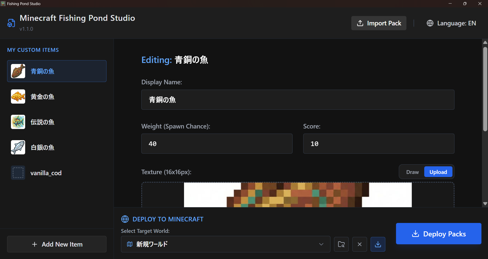
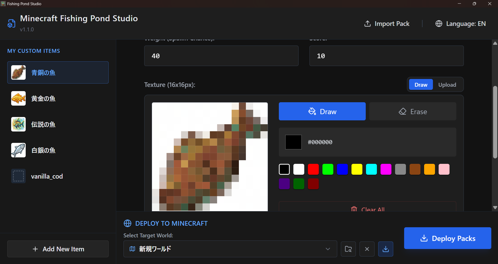
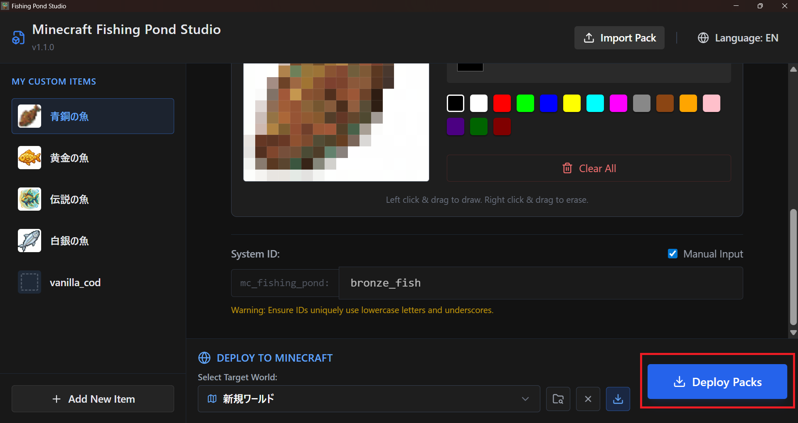
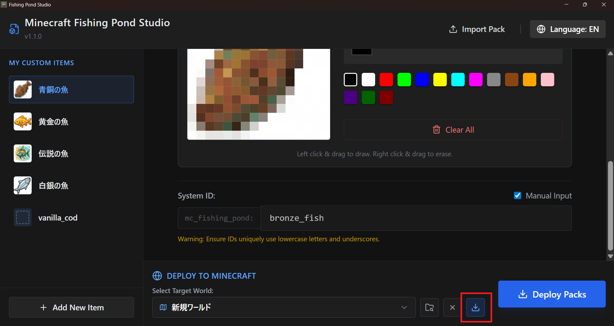

# Fishing Pond Studio User Guide (v1.1.0)

Fishing Pond Studio is a tool for intuitively creating and managing custom fishing items (Datapacks and Resourcepacks) for Minecraft.

## 1. Interface Overview

When you launch the app, you'll see the Item List on the left and the Editing Panel for the selected item on the right.

- **Left Panel**: Lists all your custom items.
- **Right Panel**: Configure the name, spawn chance (weight), score, and texture of the selected item.
- **Top Header**: Displays version info and the "Import Pack" button.

## 2. Creating and Editing Custom Items

### Basic Information

For each item, you can configure the following:

- **Display Name**: The name of the item as it appears in-game.
- **Weight (Spawn Chance)**: Adjusts how likely the item is to be caught (higher values increase the chance).
- **Score**: Sets the score earned when the item is caught.

### Setting Textures

You can set a 16x16 pixel art texture for each item.

- **Drag & Drop**: Drag an image file into the box to set it.
- **Built-in Editor**: Click the "Draw" button to paint pixel art directly within the app.

## 3. Deploying to Minecraft

Use the "Deploy to Minecraft" section at the bottom to export your data to an actual world.

1. **Select Target World**: Choose from the automatically detected list of worlds.
2. **Deploy Packs**: Click "Deploy Packs" to automatically generate and save the Datapack and Resourcepack to the selected world.

> [!TIP]
> **Multi-Profile Support**
> Even if you have multiple Minecraft profiles (Launcher configurations), the tool automatically searches for the game directory of each profile.

## 4. Loading Previous State

When you re-select a world that already has packs deployed, the "Load Previous State" button will appear.

Click this to read the metadata stored within the Resourcepack and restore your previous work (item names, painted textures, etc.) back into the app.
