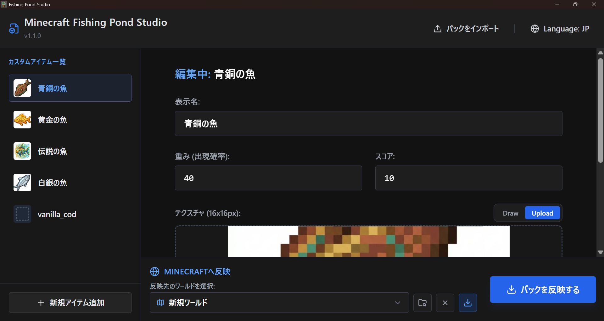
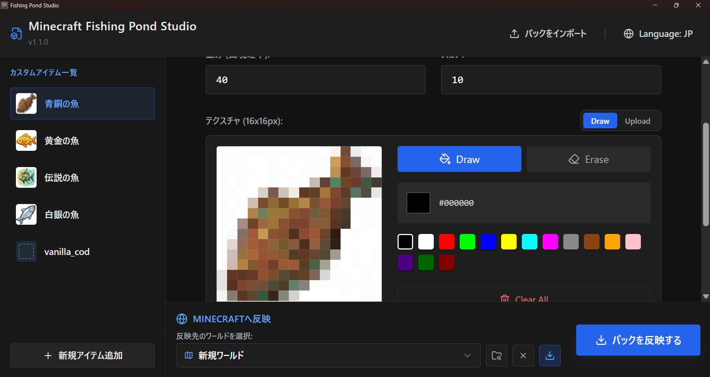
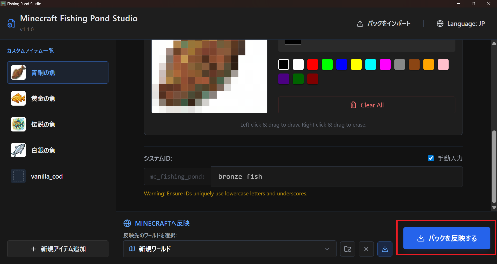
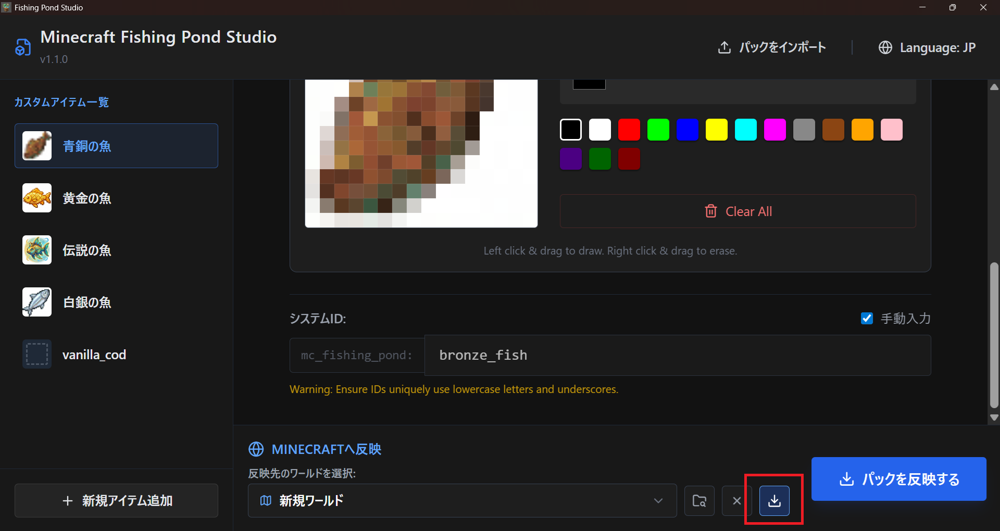

# Fishing Pond Studio 使い方ガイド (v1.1.0)

Fishing Pond Studio は、Minecraft のカスタム釣りアイテム（データパック・リソースパック）を直感的に作成・管理するためのツールです。

## 1. 画面構成の概要

アプリを起動すると、左側にアイテムリスト、右側に選択したアイテムの編集パネルが表示されます。

- **左パネル**: 作成したカスタムアイテムが一覧表示されます。
- **右パネル**: 選択中のアイテムの名前、出現確率（重み）、スコア、テクスチャなどを設定します。
- **上部ヘッダー**: バージョン情報や、既存パックのインポートボタンがあります。

## 2. カスタムアイテムの作成と編集

### 基本情報の入力

各アイテムについて、以下の項目を設定できます。

- **表示名**: ゲーム内で表示されるアイテム名です。
- **重み (出現確率)**: 釣れる確率を調整します（数値が大きいほど釣れやすくなります）。
- **スコア**: アイテムを釣った際に得られるスコアを設定します。

### テクスチャの設定

16x16ピクセルのドット絵をアイテムの見た目として設定できます。

- **ドラッグ＆ドロップ**: 手元の画像を枠内にドラッグして設定。
- **内蔵エディタ**: 「Draw」ボタンからアプリ内で直接ドット絵を描くことも可能です。

## 3. Minecraft への反映 (デプロイ)

画面下部の「Minecraftへ反映」セクションから、作成したデータを実際のワールドへデプロイできます。

1. **反映先のワールドを選択**: 自動検出されたワールドリストから選択します。
2. **パックを反映**: 「パックを反映する」ボタンを押すと、データパックとリソースパックが自動生成され、選択したワールドに保存されます。

> [!TIP]
> **マルチプロファイル対応**
> 複数の Minecraft プロファイル（ランチャーの構成）がある場合でも、自動的に各プロファイルのゲームディレクトリを探しに行きます。

## 4. 前回の状態をロード

一度デプロイしたワールドを再度選択すると、「前回の状態をロード」ボタンが表示されます。

これをクリックすると、リソースパック内に保存されているメタデータを読み込み、前回の編集内容（アイテム名や描いたドット絵など）をアプリ上に復元できます。
